# Main DDR (Detailed Diagnostic Report)

Generated On: 2026-03-14 15:56

## 1. Property Issue Summary
- Bedroom Bathroom: Observed gaps between the tile joints of Master (Severity: Medium)
- Ceiling: Observed mild dampness at the ceiling of Not Available (Severity: Medium)
- Common Bathroom: Common Bathroom tile hollowness and plumbing issue (Severity: High)
- Common Bedroom: Observed dampness at the skirting level of the Common Bedroom of Flat No. 103 (Severity: Medium)
- External Wall: Observed cracks on the External wall of building (Severity: High)
- Master Bedroom: Observed gaps between the tile joints of Master (Severity: Low)
- Nahani Trap: Leakage due to damage in Nahani trap/Brickbat coba under tile flooring (Severity: High)
- Parking: Observed leakage at the Parking ceiling (Severity: High)

## 2. Area-wise Observations
### Bedroom Bathroom
- Observations:
  - Observed gaps between the tile joints of Master
  - Observed dampness & efflorescence on Not Available
- Inspection Images:
  - Positive side photographs
    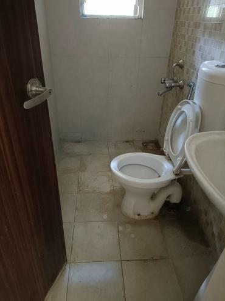
  - Photo 33 Photo 34 Photo 35 Photo 36 Photo 37
    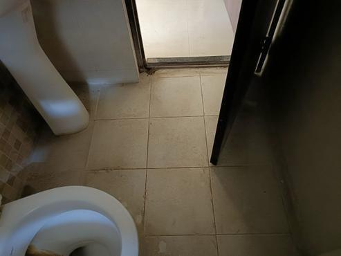
  - Photo 33 Photo 34 Photo 35 Photo 36 Photo 37
    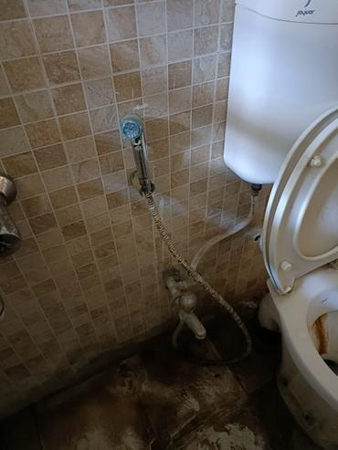
  - Positive side Description Master bedroom bathroom
    
- Thermal Images: Image Not Available

### Ceiling
- Observations:
  - Observed mild dampness at the ceiling of Not Available
- Inspection Images:
  - Negative side Description Hall Skirting level Dampness
    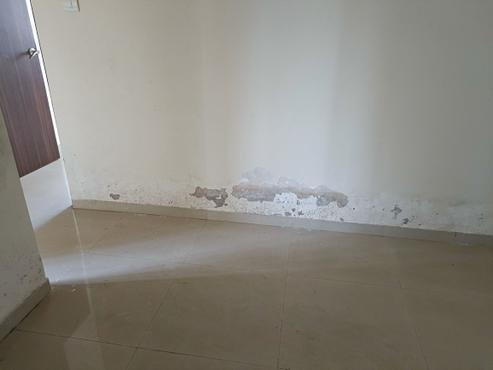
  - Negative side Description Hall Skirting level Dampness
    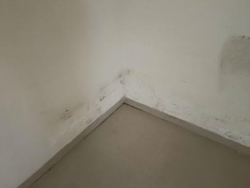
  - Dampness
    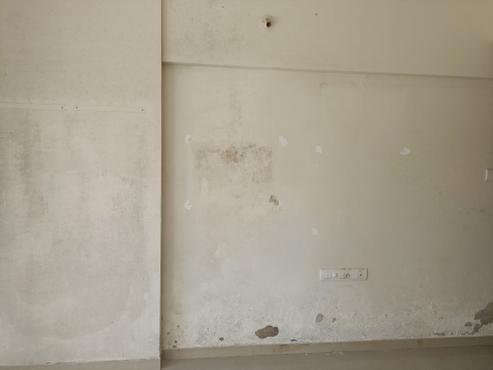
  - Dampness
    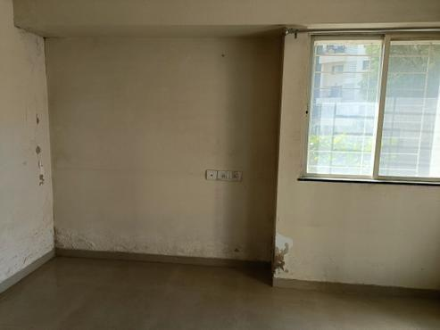
- Thermal Images: Image Not Available

### Common Bathroom
- Observations:
  - Common Bathroom tile hollowness and plumbing issue
  - Leakage due to concealed plumbing
  - Internal WC/Bath/Balcony leakage observed
  - Observed gaps between the tile joints of Not Available
  - Observed plumbing issue & gaps between the tile joints of Common Bathroom of Flat No. 103
  - Observed gap between tile joints of Common
- Inspection Images:
  - Common Bathroom tile hollowness and plumbing issue
    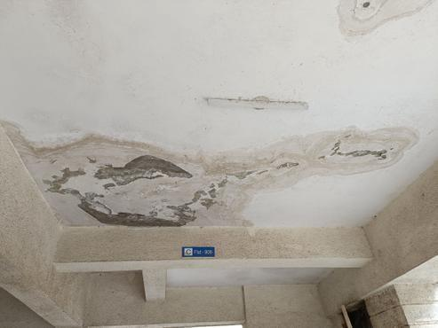
  - Common Bathroom tile hollowness and plumbing issue
    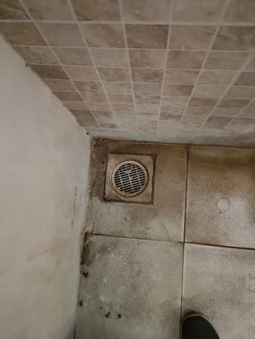
  - Positive side Description Flat no 203 tile joint open and
    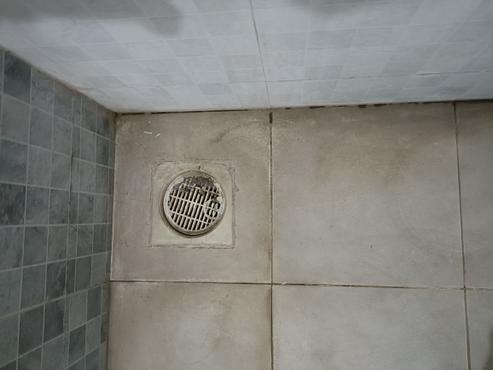
  - Positive side Description Flat no 203 tile joint open and
    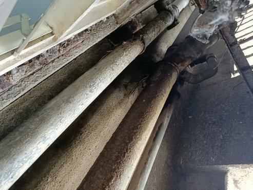
- Thermal Images: Image Not Available

### Common Bedroom
- Observations:
  - Observed dampness at the skirting level of the Common Bedroom of Flat No. 103
  - Observed gaps between the tile joints of Not Available
- Inspection Images:
  - Negative side Description Hall Skirting level Dampness
    
  - Negative side Description Hall Skirting level Dampness
    
  - Negative side Description Bedroom Skirting level
    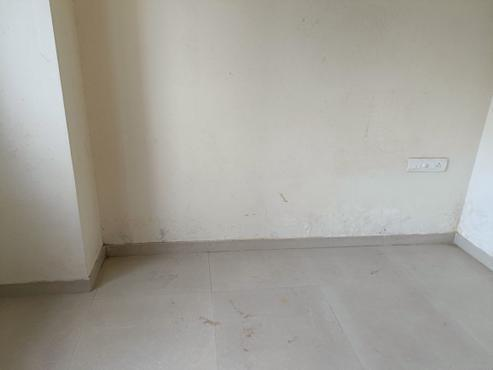
  - Positive side Description Common Bathroom tile
    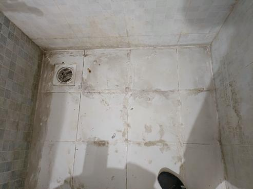
- Thermal Images: Image Not Available

### External Wall
- Observations:
  - Observed cracks on the External wall of building
- Inspection Images:
  - Positive side Description External wall crack and Duct
    
  - Positive side Description External wall crack and Duct
    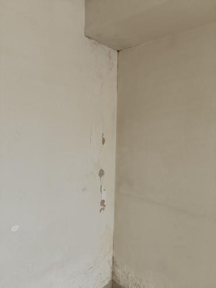
  - Positive side Description External wall crack and Duct
    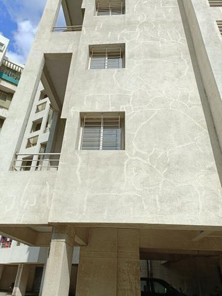
  - Loose plaster/hollow sond on external surfaces?if observed, N/A
    
- Thermal Images: Image Not Available

### Master Bedroom
- Observations:
  - Observed gaps between the tile joints of Master
- Inspection Images:
  - Positive side photographs
    
  - Photo 33 Photo 34 Photo 35 Photo 36 Photo 37
    
  - Photo 33 Photo 34 Photo 35 Photo 36 Photo 37
    
  - Positive side Description Master bedroom bathroom
    
- Thermal Images: Image Not Available

### Nahani Trap
- Observations:
  - Leakage due to damage in Nahani trap/Brickbat coba under tile flooring
- Inspection Images:
  - Positive side Description Common Bathroom tile
    
  - Positive side Description Common Bathroom tile
    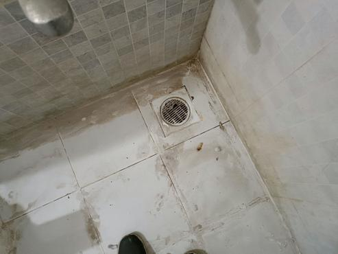
  - Positive side Description MB Bathroom tile hollowness
    
  - Positive side Description MB Bathroom tile hollowness
    
- Thermal Images: Image Not Available

### Parking
- Observations:
  - Observed leakage at the Parking ceiling
- Inspection Images:
  - Negative side Description Common Bathroom Ceiling
    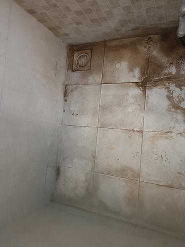
  - Loose plaster/hollow sond on external surfaces?if observed, N/A
    
  - Photo 1 Photo 2
    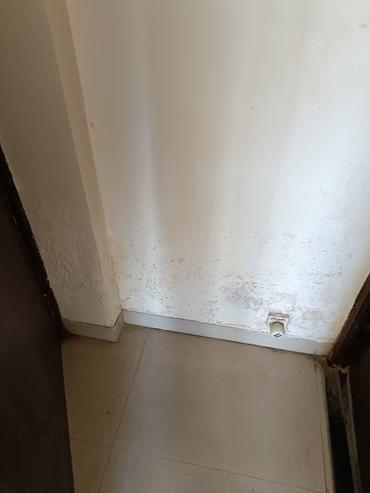
  - Appendix
    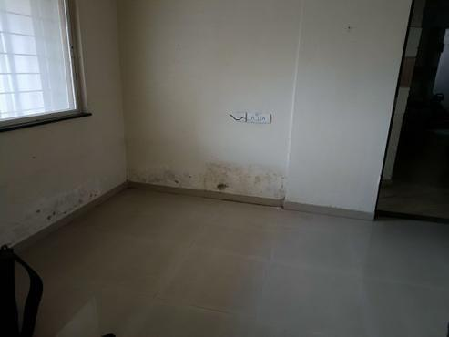
- Thermal Images: Image Not Available

### Skirting
- Observations:
  - Observed dampness at the skirting level
- Inspection Images:
  - Negative side Description Hall Skirting level Dampness
    
  - Negative side Description Hall Skirting level Dampness
    
  - Negative side Description Bedroom Skirting level
    
  - Dampness
    
- Thermal Images: Image Not Available

## 3. Probable Root Cause
- Bedroom Bathroom: Possible moisture ingress or material/plumbing deterioration based on observed symptoms.
- Ceiling: Possible moisture ingress or material/plumbing deterioration based on observed symptoms.
- Common Bathroom: Possible concealed plumbing leakage and failed waterproofing at wet areas.
- Common Bedroom: Possible moisture ingress or material/plumbing deterioration based on observed symptoms.
- External Wall: Possible structural movement and weather exposure causing crack propagation and moisture entry.
- Master Bedroom: Possible moisture ingress or material/plumbing deterioration based on observed symptoms.
- Nahani Trap: Possible concealed plumbing leakage and failed waterproofing at wet areas.
- Parking: Possible concealed plumbing leakage and failed waterproofing at wet areas.
- Skirting: Possible moisture ingress or material/plumbing deterioration based on observed symptoms.

## 4. Severity Assessment (with reasoning)
- Bedroom Bathroom: Medium - Moisture and finish-level issues are visible and need planned corrective action. Thermal temperature delta observed up to 5.40°C (area mapping not available).
- Ceiling: Medium - Moisture and finish-level issues are visible and need planned corrective action. Thermal temperature delta observed up to 5.40°C (area mapping not available).
- Common Bathroom: High - Leakage/crack/plumbing indicators suggest active damage that can worsen if delayed. Thermal temperature delta observed up to 5.40°C (area mapping not available).
- Common Bedroom: Medium - Moisture and finish-level issues are visible and need planned corrective action. Thermal temperature delta observed up to 5.40°C (area mapping not available).
- External Wall: High - Leakage/crack/plumbing indicators suggest active damage that can worsen if delayed. Thermal temperature delta observed up to 5.40°C (area mapping not available).
- Master Bedroom: Low - Only limited or generic observations are available for this area. Thermal temperature delta observed up to 5.40°C (area mapping not available).
- Nahani Trap: High - Leakage/crack/plumbing indicators suggest active damage that can worsen if delayed. Thermal temperature delta observed up to 5.40°C (area mapping not available).
- Parking: High - Leakage/crack/plumbing indicators suggest active damage that can worsen if delayed. Thermal temperature delta observed up to 5.40°C (area mapping not available).
- Skirting: Medium - Moisture and finish-level issues are visible and need planned corrective action. Thermal temperature delta observed up to 5.40°C (area mapping not available).

## 5. Recommended Actions
### Bedroom Bathroom
- Remove damaged plaster/paint, dry substrate, and apply waterproof treatment before repainting.
### Ceiling
- Remove damaged plaster/paint, dry substrate, and apply waterproof treatment before repainting.
### Common Bathroom
- Pressure-test and repair leaking plumbing lines and joints.
### Common Bedroom
- Remove damaged plaster/paint, dry substrate, and apply waterproof treatment before repainting.
### External Wall
- Inspect crack depth, stitch/seal as needed, then re-finish affected wall surfaces.
### Master Bedroom
- Conduct targeted inspection and apply area-specific corrective maintenance.
### Nahani Trap
- Pressure-test and repair leaking plumbing lines and joints.
### Parking
- Pressure-test and repair leaking plumbing lines and joints.
### Skirting
- Remove damaged plaster/paint, dry substrate, and apply waterproof treatment before repainting.

## 6. Additional Notes
- No direct text conflicts detected between extracted observations.
- High thermal deltas detected (area label not reliably available in source text):
  - Thermal page 1: Hotspot 28.8°C, Coldspot 23.4°C, Delta 5.4°C, Image RB02380X.JPG
    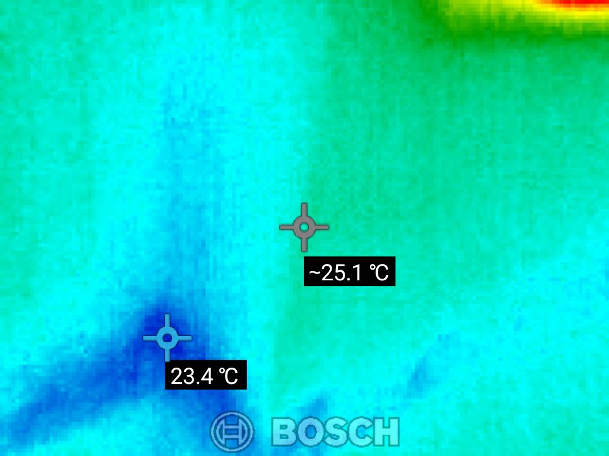
    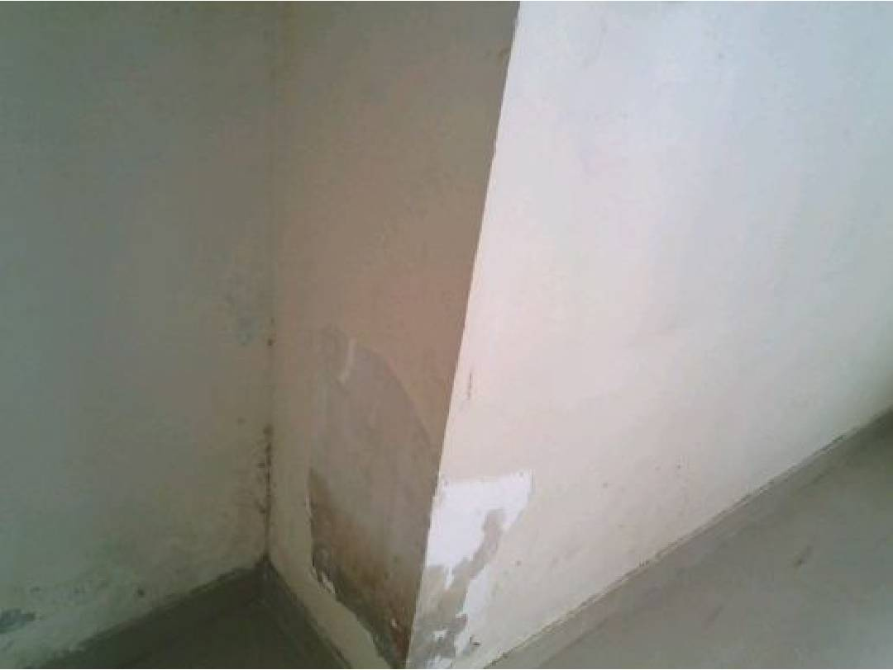
  - Thermal page 2: Hotspot 27.4°C, Coldspot 22.4°C, Delta 5.0°C, Image RB02386X.JPG
    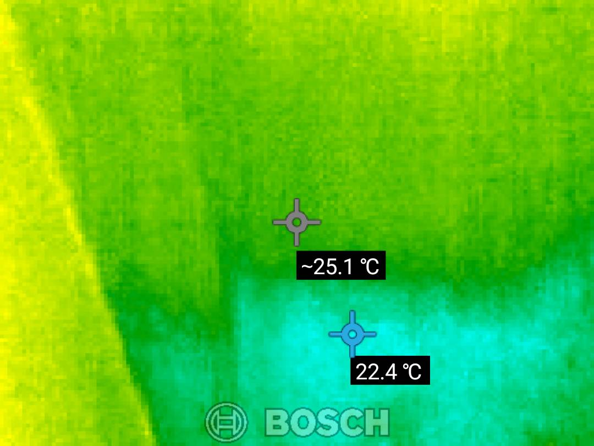
    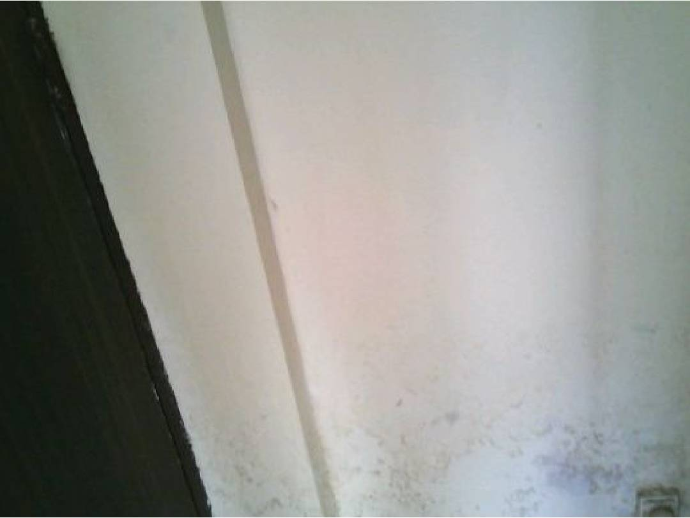
  - Thermal page 3: Hotspot 27.0°C, Coldspot 22.0°C, Delta 5.0°C, Image RB02395X.JPG
    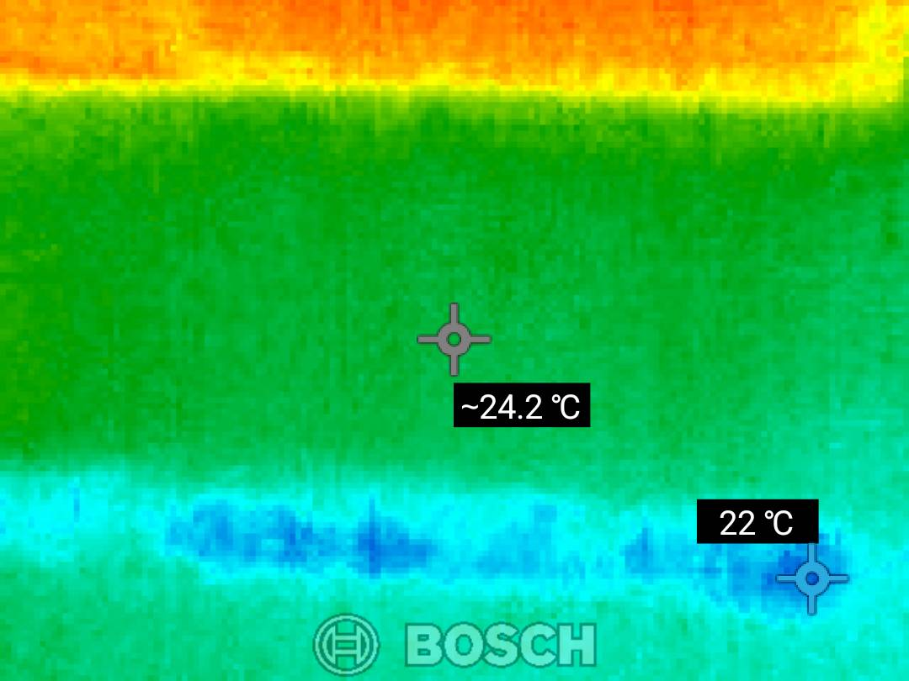
    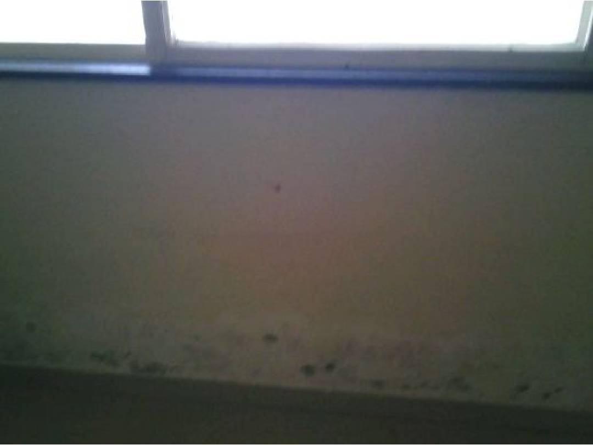
  - Thermal page 4: Hotspot 25.7°C, Coldspot 20.7°C, Delta 5.0°C, Image RB02402X.JPG
    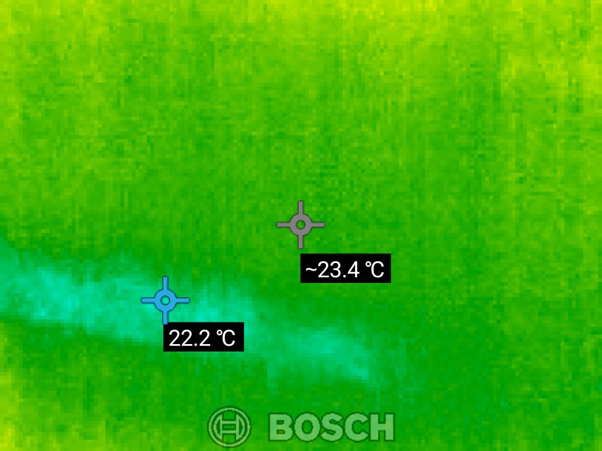
    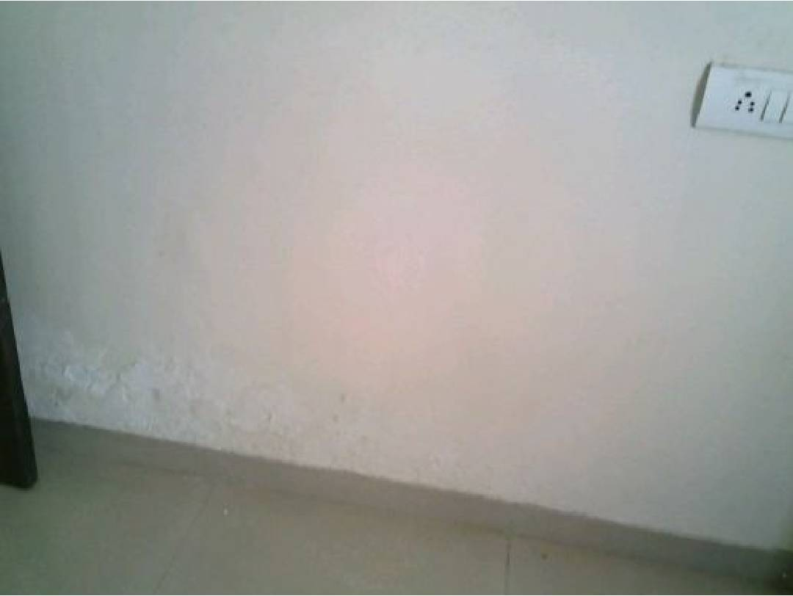
  - Thermal page 5: Hotspot 25.5°C, Coldspot 20.5°C, Delta 5.0°C, Image RB02403X.JPG
    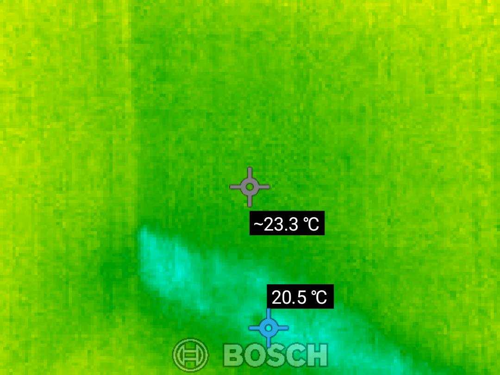
    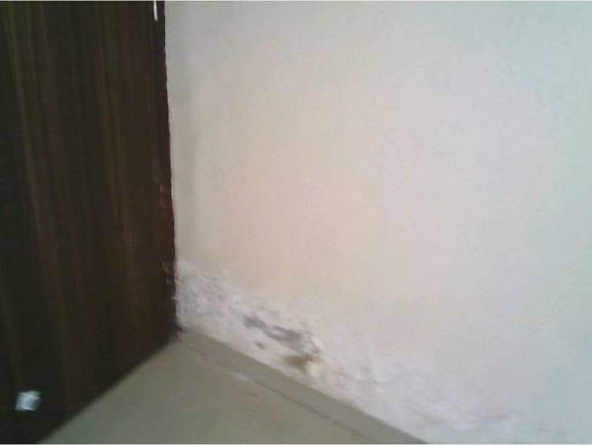
  - Thermal page 6: Hotspot 25.8°C, Coldspot 20.8°C, Delta 5.0°C, Image RB02404X.JPG
    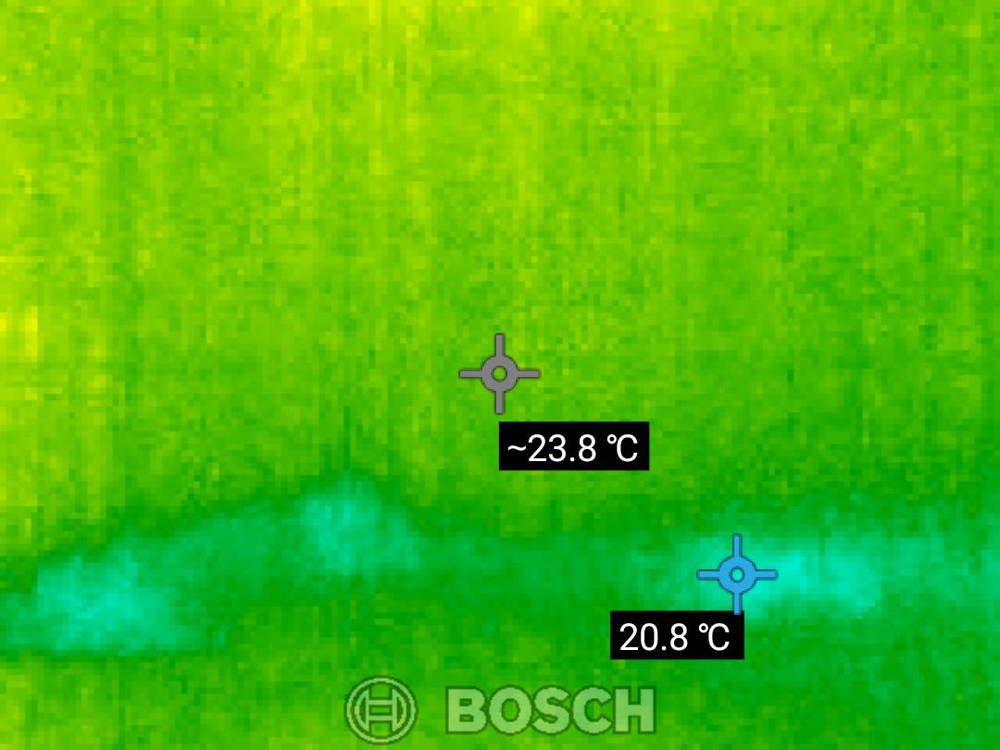
    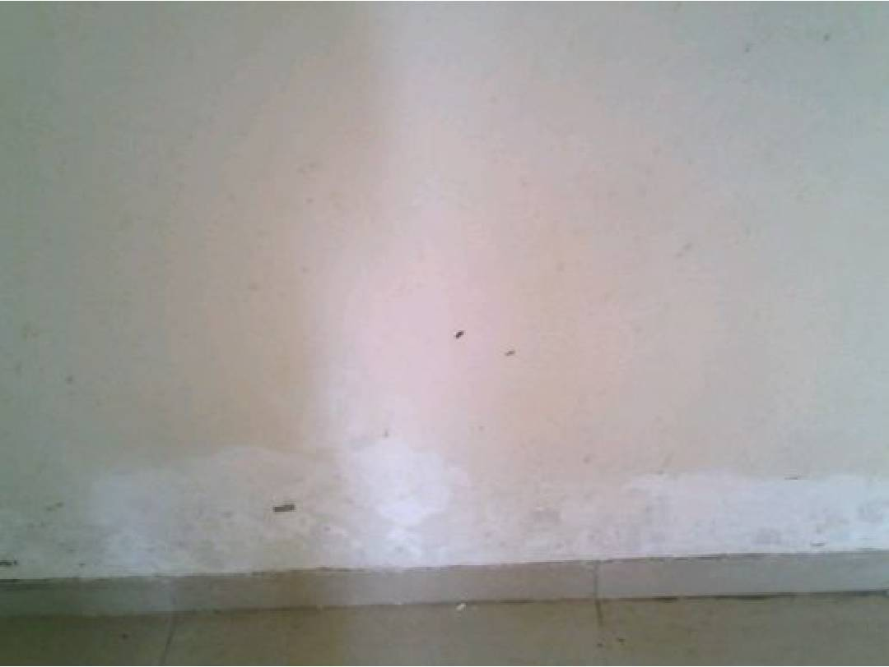

## 7. Missing or Unclear Information
- Thermal image to area mapping: Not Available (thermal pages do not consistently provide area labels in extractable text).